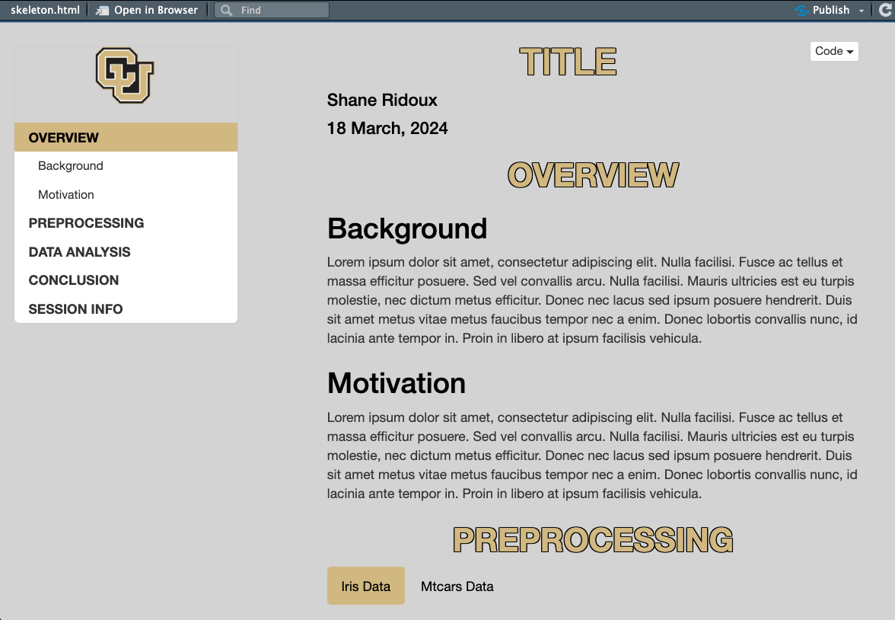

To install these templates in R copy and paste the code below:
install.packages("devtools")  
devtools::install_github("shaneridoux/School-Templates")
  
The HW Template produces a pdf that looks like:

  
The HTML Template produces a html file that looks like: 

